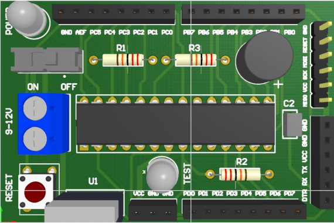
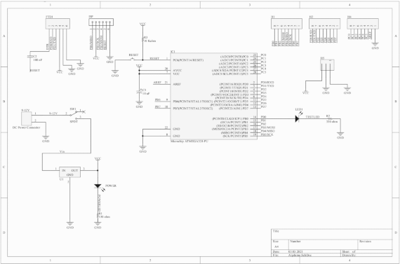

## Descripion
This project is a PCB development of a standalone Arduino UNO compatible ATmega328p board built in [CircuitMaker](https://workspace.circuitmaker.com/Projects/Details/Farid-Oubbati-2/Algduino-Stripped)

PCB 3D view:

PCB Schematic:

## Bill of materials used in this project
* 1 ATmega328p microcontroller
* 1 L7805 voltage regulator
* 1 PCB DC Socket
* 1 Slide switch
* 1 Push button
* 2 5mm LED
* 1 100n ceramic capacitor
* 1 10uf polarized capacitor
* 2 330 ohm resistor
* 1 10 kohm resistor
* 5 2.54mm Female pin header
* 1 5 2.54mm Male pin header
